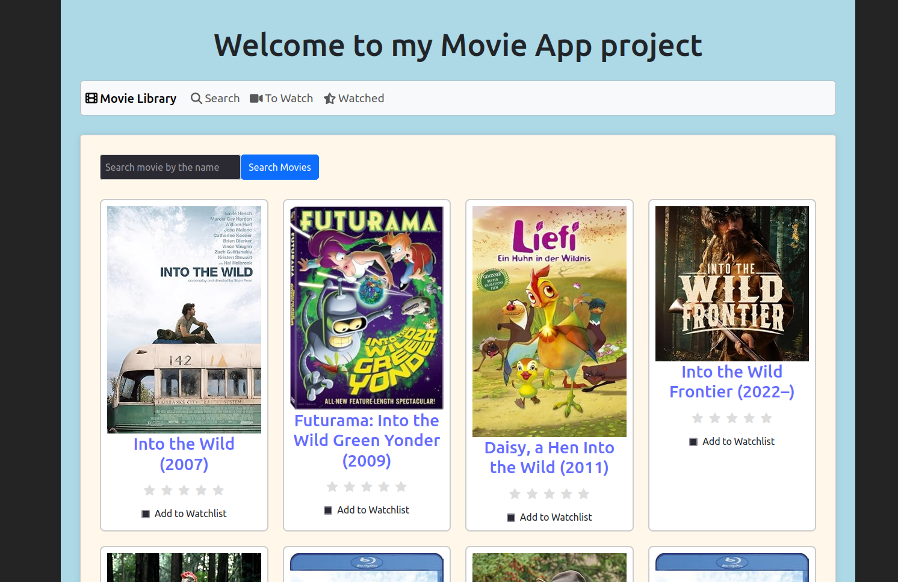
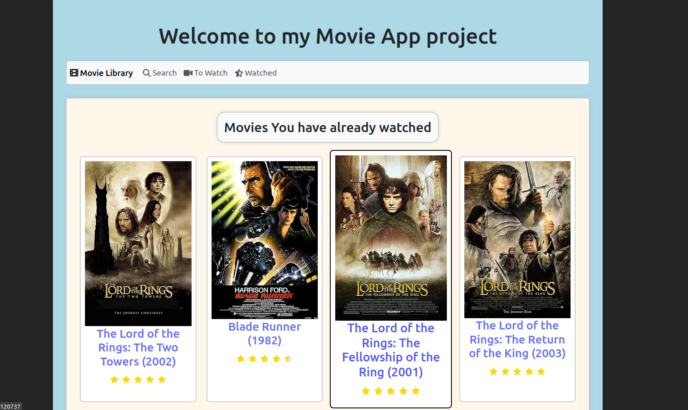

<h1 align="center"><strong>Movie app (React + Vite + Redux workshop)</strong></h1>

## Description

This is a movie management application built with React, Vite, and Redux, developed as part of a React/Redux course.
The app integrates with the OMDB API to fetch movie data, allowing users to search for movies, add them to a "To Watch" list, and mark them as watched.
The state management is powered by Redux, utilizing slices and redux-persist to maintain user data across sessions, while react-bootstrap is used for styling.

## Backend
The backend API is provided by [OMDb](http://www.omdbapi.com). You can generate your own key here: [API key](http://www.omdbapi.com/apikey.aspx)

## Frontend

### Tech Stack:
- **Framework/Library:** Vite + React
- **Language:** JS (ES6+), HTML (JSX), CSS
- **Other**: Redux, Redux Toolkit, redux-persist, react-router, Bootstrap/React Bootstrap, Font Awesome

## Setup

1. Clone the repository.
2. Run the command `npm install` to install dependencies.
3. Generate your own [API key](http://www.omdbapi.com/apikey.aspx) and put it in env file (env.example provided).
4. Run the command  `npm run dev` to start frontend development server and have fun.

## Visualisation

### Search Page example:

### Watched List example:

## License
You are free to use, modify, and distribute this (frontend part of) application for your private, personal use.

## Author
- **email**: [mateusz.marciszm@gmail.com](mailto:mateusz.marciszm@gmail.com)
- **github**: [MateuszMarcisz](https://github.com/MateuszMarcisz)
- **CodeWars**: [T0dl3r](https://www.codewars.com/users/T0dl3r)
- **GS**: [GoogleScholar](https://scholar.google.com/citations?user=QW3tlewAAAAJ&hl=en)
